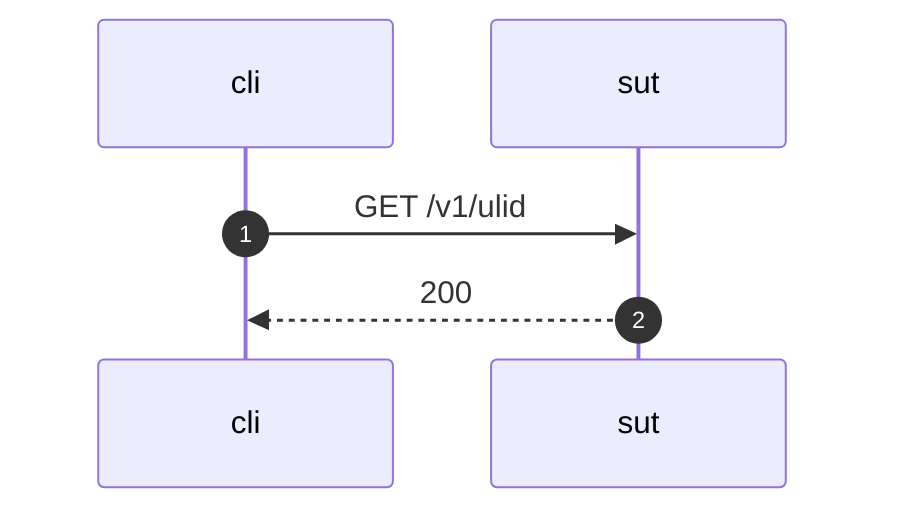

## GET /v1/ulid

  

  
## Event log
#### Event 1
  
GET /v1/ulid HTTP/1.1  
Host: sut  
  

  
---
  
#### Event 2
  
HTTP/1.1 200 OK  
Connection: close  
Content-Type: application/json; charset=UTF-8  
  

  
```json
{
    "ulid": "01HED16HC9ZKXZX5QBVYJCSFBG"
}

```
  
---
  